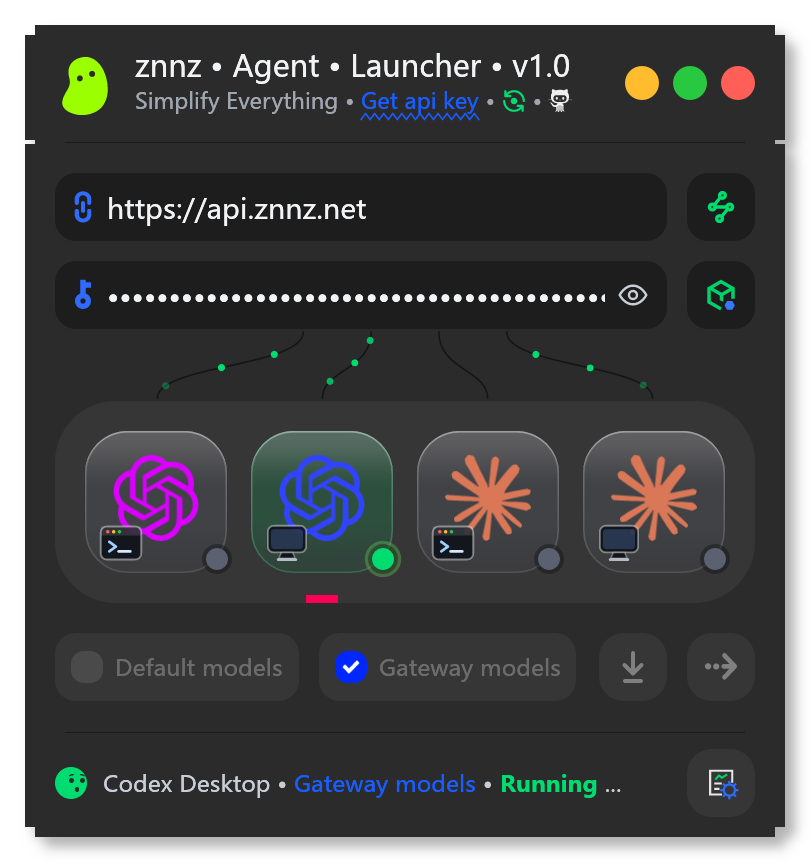
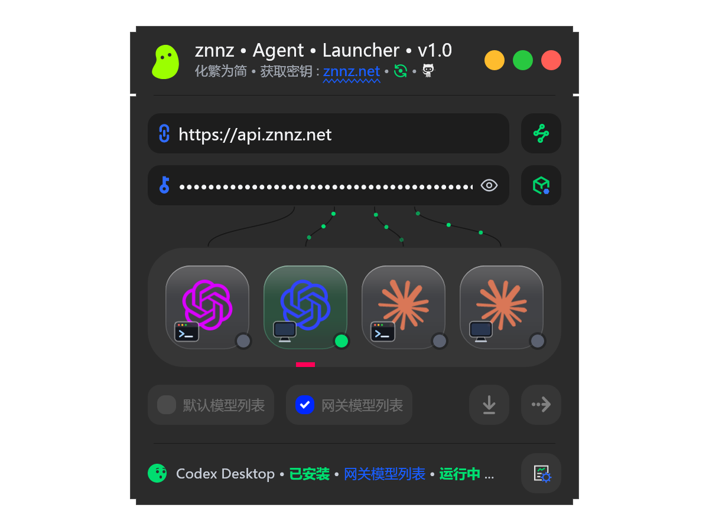

# znnz.net Agent Launcher

A simple and easy-to-use AI Agent launcher.

Quickly install • configure • launch Codex CLI & Codex Desktop & Claude Code & Claude Desktop. The default gateway is [znnz.net](https://znnz.net), and other AI gateways and API keys compatible with standard protocols are also supported.

## Usage

1. Open the launcher.
2. Enter the API endpoint and API Key.
3. Select a client and model list.
4. Click Install Client or Configure • Launch.

The launcher automatically detects client status and provides the gateway's available model list, connection testing, and runtime logs.

## 中文

一个简洁易用的 AI Agent 启动器。

可以快速安装 • 配置 • 启动 Codex CLI & Codex Desktop & Claude Code & Claude Desktop，默认网关使用 [znnz.net](https://znnz.net) ，也支持填写其他兼容标准协议的 AI 网关和 API Key。

## 使用

1. 打开启动器。
2. 填写接口地址和 API Key。
3. 选择客户端及模型列表。
4. 点击安装客户端或配置 • 启动。

启动器会自动检测客户端状态，并提供网关可用模型列表、连接测试和运行日志。

## License / 开源协议

This project is licensed under the [Apache License 2.0](LICENSE).

本项目使用 [Apache License 2.0](LICENSE) 开源。

The license does not grant permission to use the `znnz.net` name, logo, or visual identity to imply that a modified build is an official release. See [NOTICE](NOTICE).

该协议不授予使用 `znnz.net` 名称、Logo 或视觉标识来暗示修改版是官方版本的权利。详见 [NOTICE](NOTICE)。
