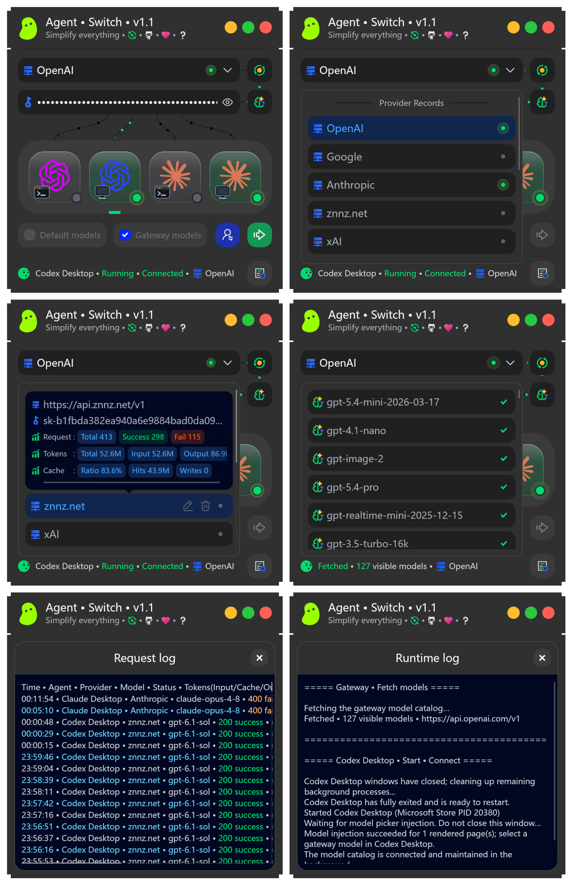

# Agent-Switch

> English | [中文](README_ZH.md)

A free, lightweight AI gateway manager that lets Codex and Claude clients share a switchable, observable local gateway with multi-provider management, local protocol conversion, model injection, and usage statistics.

## Features

- 🚀 **One-click client installation** • Install Codex CLI, Codex Desktop, Claude Code, and Claude Desktop from Agent-Switch.
- 🔀 **Multi-provider management** • Save multiple provider endpoints and API Keys, rename entries, reorder them by dragging, and switch quickly.
- 🔄 **Provider switching** • Changing a provider endpoint or API Key automatically restarts the related Agent client and reloads its configuration.
- 🔐 **Account mode switching** • Switch between local gateway mode and the client’s official account mode without signing out, while restoring the original configuration automatically.
- 🔌 **Independent client connections** • Manage installation, runtime, connection state, and gateway routing for all four Agent clients separately.
- 🧩 **Local protocol conversion** • Convert between OpenAI, Anthropic, Gemini, and other protocols locally. Same-family models are preferred for direct pass-through, and conversion can be toggled live. See the FAQ below.
- 📥 **Gateway model management** • Fetch model lists from providers and hide legacy or unused models for each provider.
- 🗂️ **Model mapping injection** • Inject provider models into the Agent client model picker so they can be selected directly.
- 📊 **Provider usage statistics** • Track request counts and Token usage separately for each provider.
- 💡 **Real-time status detection** • Detect whether each Agent client is installed, running, and connected to the gateway.
- 🛡️ **Protected configuration** • API Keys are encrypted locally, and the gateway listens only on the local loopback address.
- 📝 **Runtime logs** • Record client startup, connection, restart, model injection, and gateway operations.
- 📋 **Request logs** • Record the Agent, provider, model, status code, Tokens, duration, time to first token, endpoint, and protocol conversion details.
- 🌍 **Chinese and English UI** • Support localized interface text and log output.

## Agent client status lights

- ⚪ **Gray with ×** • Not installed
- ⚪ **Gray** • Not running
- 🔵 **Blue** • Running, not connected to the local gateway
- 🟢 **Green** • Connected to the local gateway

## Provider flow indicators

- ⚫ **Black** • Not connected
- 🟢 **Green** • Connected; moving dots do not represent real-time data transfer

## Usage

1. Open Agent-Switch and enter an endpoint and API Key, or choose a provider preset.
2. Fetch the models and choose which models should be mapped into the Agent client.
3. Select a client and click **Start • Connect**.

After changing the endpoint or API Key, click **Restart • Connect**. Agent-Switch automatically restarts the related client. Protocol conversion can be toggled independently without restarting the client.

Closing the Agent-Switch window keeps the local gateway running in the system tray. Choose **Exit** to stop the gateway completely. You must click **Start • Connect** again the next time you use a client.

## Frequently asked questions

### What is local gateway mode?

In local gateway mode, an Agent client such as Claude Code or Codex Desktop connects to Agent-Switch first. Agent-Switch then forwards requests to the actual AI provider, including official APIs or third-party gateways.

The local gateway handles protocol conversion, request routing, provider switching, and API Key management, making it easier for different clients to use different models.

### What is account mode?

In account mode, the Agent client connects and chats directly through the signed-in official account of the AI provider. Requests do not use Agent-Switch’s local gateway route.

### What is protocol conversion?

Protocol conversion translates the API format used by a Agent client into the format supported by the upstream model service, and converts requests and responses in both directions, including streaming responses.

The main formats currently involved in local protocol conversion include:

- OpenAI Chat Completions
- OpenAI Responses
- Anthropic Messages
- Gemini GenerateContent

### When should local protocol conversion be enabled?

Enable it when you need to use a model from a different model family, for example:

- Using Claude, Gemini, or another model family in Codex.
- Using GPT, Grok, Gemini, or another model family in Claude.

### When should local protocol conversion be disabled?

- When you do not need cross-family models.
- When the provider already performs protocol conversion on the server. Disabling local conversion avoids converting the request twice.
- Grok natively supports OpenAI Responses, so local conversion is usually unnecessary when using Grok in Codex.

### Does the gateway stop when the Agent-Switch window is closed?

No. Closing the window leaves the gateway running in the system tray so connected clients can continue making requests. Choose **Exit** from the tray menu to stop the gateway completely. You must click **Start • Connect** again the next time you use a client.

### Where are API Keys stored?

API Keys are encrypted and stored locally. The gateway listens only on the local loopback address and does not expose a listener on the LAN or public Internet.

### How can I report a bug?

Bug reports: heimen115@gmail.com

## License

This project is released under the [Apache License 2.0](LICENSE).
