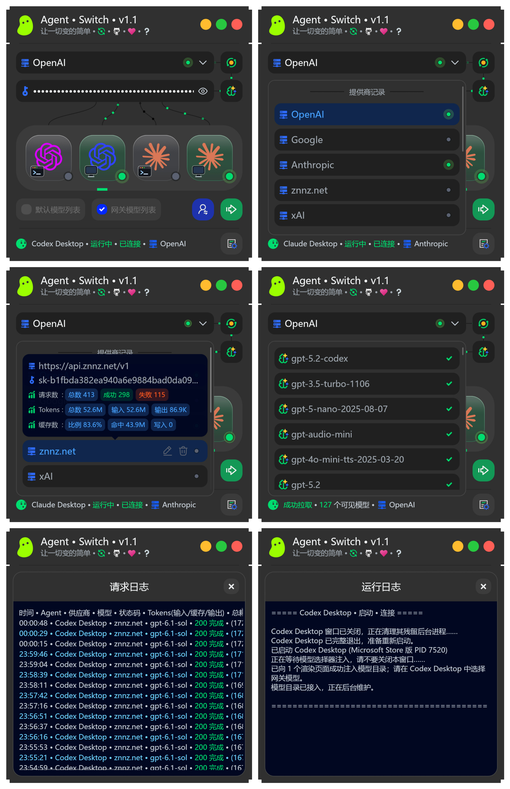

# Agent-Switch

> [English](README.md) | 中文

一个免费、轻量的 AI 网关管理器，让 Codex 与 Claude 客户端共享一个可切换、可观测的本地网关，支持多供应商管理、本地协议转换、模型映射注入和用量统计。

## 主要功能

- 🚀 **客户端一键安装** • 支持一键安装 Codex CLI、Codex Desktop、Claude Code、Claude Desktop。
- 🔀 **多供应商管理** • 保存多个供应商的接口地址和 API Key，支持重命名、拖动排序和快速切换。
- 🔄 **供应商切换** • 切换供应商接口地址或 API Key 后，自动重启相关 Agent 客户端并重新加载配置。
- 🔐 **账号模式切换** • 可在本地网关模式与 Agent 客户端官方账号模式之间切换，无需退出账号登录，并自动恢复原始配置。
- 🔌 **多客户端独立接入** • 分别管理四类 Agent 客户端的安装、运行、连接状态和网关路由。
- 🧩 **本地协议转换** • 支持 OpenAI、Anthropic、Gemini 等协议转换；同族模型优先直接转发，并支持热开关。详情见下方常见问题。
- 📥 **网关模型拉取管理** • 从供应商拉取模型列表，按供应商隐藏老旧或不常用模型。
- 🗂️ **模型映射注入** • 将供应商模型注入 Agent 客户端的模型列表，方便直接选择使用。
- 📊 **供应商用量统计** • 按供应商独立统计请求数和 Token 用量。
- 💡 **实时状态检测** • 自动检测 Agent 客户端是否安装、运行和连接网关。
- 🛡️ **安全配置保护** • API Key 使用本地加密保存，网关仅监听本机回环地址。
- 📝 **运行日志** • 记录客户端启动、连接、重启、模型注入和网关操作过程。
- 📋 **请求日志** • 记录 Agent、供应商、模型、状态码、Token、耗时、首字延迟、请求端点和协议转换等信息。
- 🌍 **中英文界面** • 支持中文和英文界面及日志输出。

## Agent 客户端状态灯

- ⚪ **灰色（×）** • 未安装
- ⚪ **灰色** • 未运行
- 🔵 **蓝色** • 运行中，未连接本地网关
- 🟢 **绿色** • 已连接本地网关

## 服务商流动光点状态

- ⚫ **黑色** • 未连接
- 🟢 **绿色** • 已连接；流动光点不代表实时数据传输

## 使用方式

1. 打开 Agent-Switch，输入接口地址和 API Key，或选择供应商预设。
2. 拉取模型，并选择要映射注入到 Agent 客户端的模型。
3. 选择客户端，点击 **启动 • 连接**。

切换接口地址或 API Key 后，点击 **重启 • 连接**，Agent-Switch 会自动重启相关客户端。协议转换可以单独热切换，无需重启客户端。

关闭 Agent-Switch 窗口后，本地网关会继续在系统托盘运行。选择 **退出** 才会完全停止网关；再次使用时，需要重新点击 **启动 • 连接**。

## 常见问题

### 本地网关模式是什么？

Agent 客户端(例如 Claude Code、Codex Desktop)先连接到 Agent-Switch 的本地网关，再由网关将请求转发到真正的 AI 模型服务商，包括官方 API 或第三方中转服务。

本地网关负责协议转换、请求路由、供应商切换和密钥管理，让不同客户端能够更方便地调用不同模型。

### 账号模式是什么？

账号模式下，Agent 客户端直接通过已登录的 AI 服务商官方账号连接和对话，不使用 Agent-Switch 的本地网关路由。

### 什么是协议转换？

协议转换是指在 AI 网关或代理中，将 Agent 客户端使用的一种 API 格式自动翻译成上游模型支持的另一种格式，并对请求和响应进行双向转换，包含流式响应。

当前涉及的本地协议转换主要格式包括：

- OpenAI Chat Completions
- OpenAI Responses
- Anthropic Messages
- Gemini GenerateContent

### 什么情况需要开启本地协议转换？

当你需要使用跨族的模型时，建议开启本地协议转换，例如：

- 在 Codex 中使用 Claude、Gemini 或其他模型族的模型。
- 在 Claude 中使用 GPT、Grok、Gemini 或其他模型族的模型。

### 什么情况建议关闭本地协议转换？

- 不需要使用跨族模型时。
- 供应商已经提供服务端协议转换时，建议关闭本地协议转换，避免重复转换。
- Grok 原生支持 OpenAI Responses，因此在 Codex 中使用 Grok 通常不需要开启本地协议转换。

### 关闭 Agent-Switch 窗口后网关会停止吗？

不会。关闭窗口后网关会继续在系统托盘运行，以保持已连接客户端的网络请求。选择托盘菜单中的 **退出** 才会完全停止网关；再次使用时，需要重新点击 **启动 • 连接**。

### API Key 会保存在哪里？

API Key 会在本机加密保存。网关只监听本机回环地址，不对局域网或公网开放监听端口。

### 如何反馈问题？

BUG 反馈邮箱：heimen115@gmail.com

## 开源协议

本项目使用 [Apache License 2.0](LICENSE) 开源。